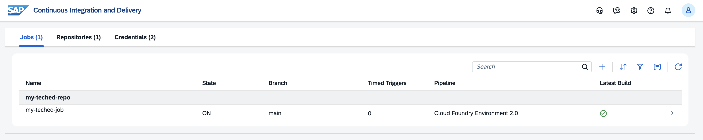
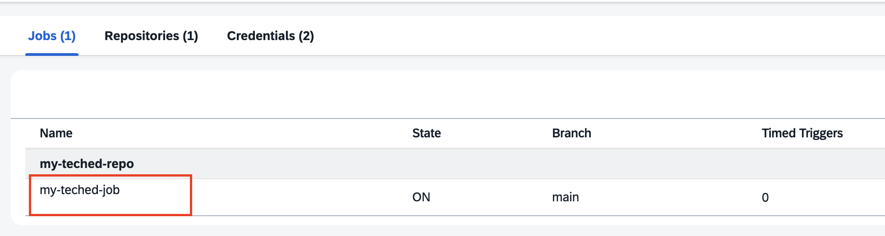
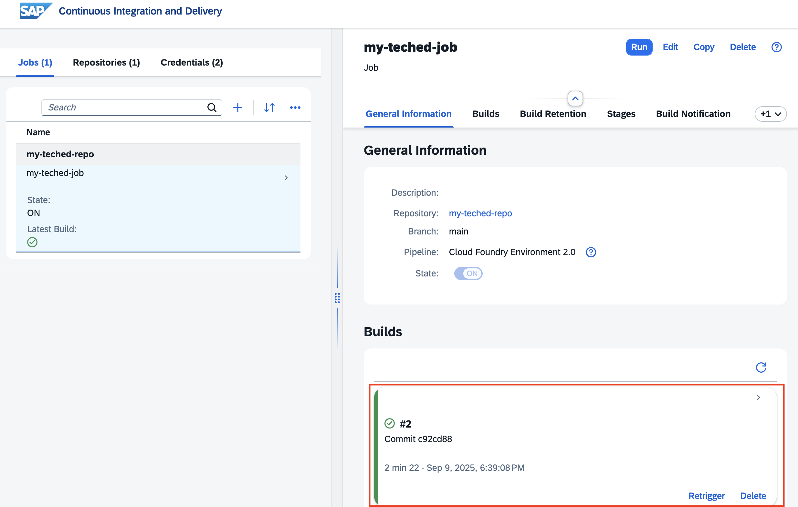
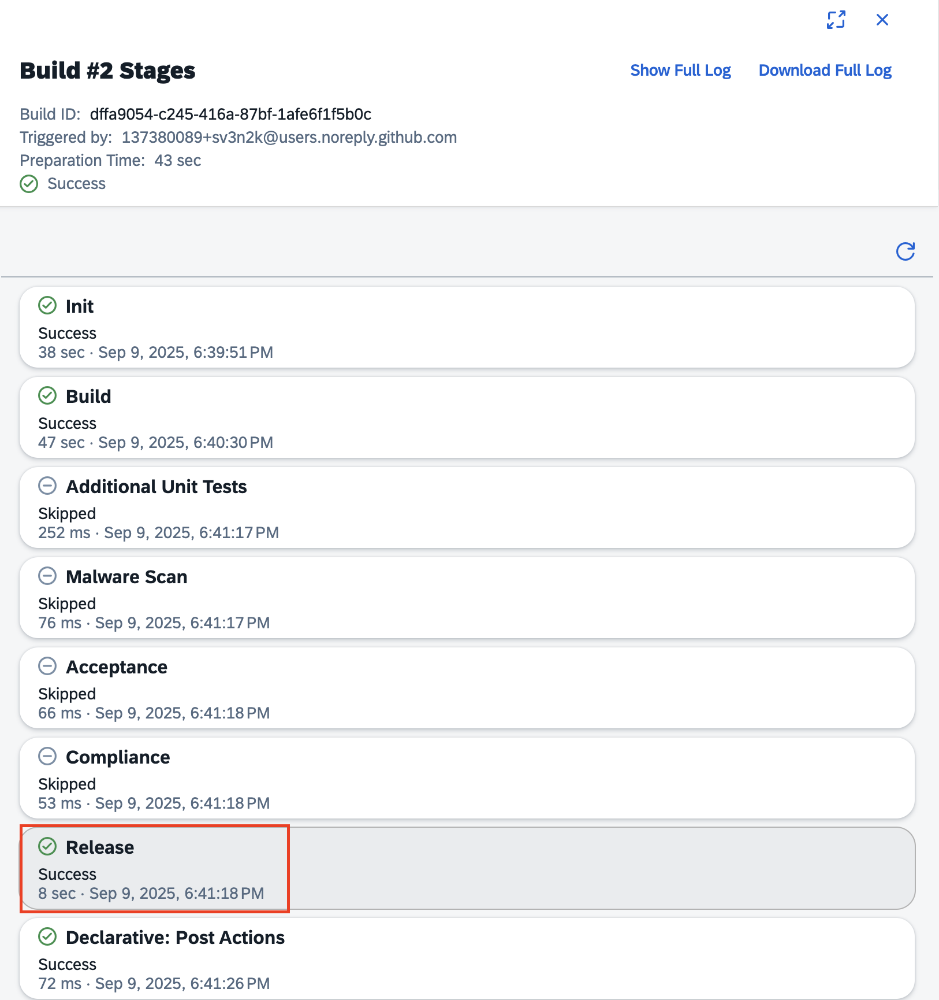
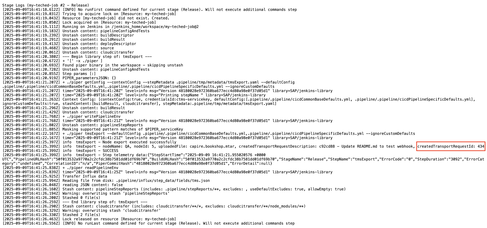
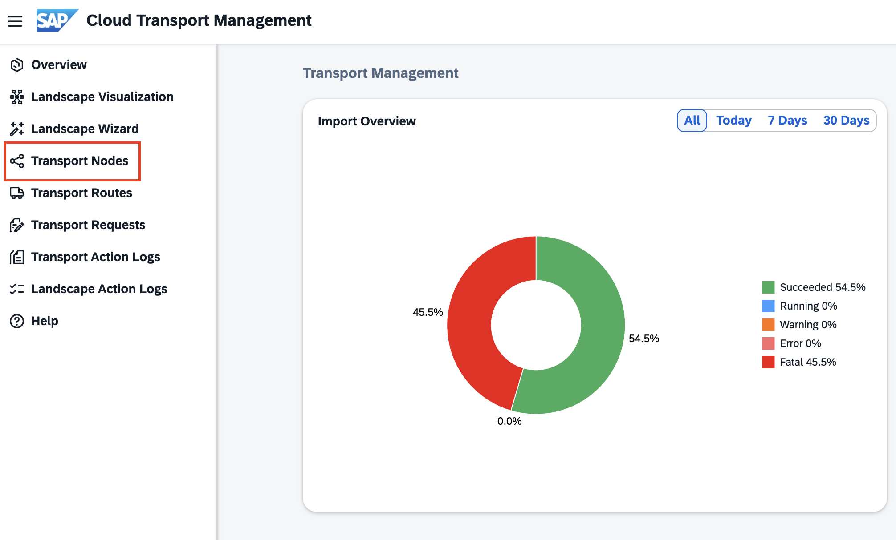
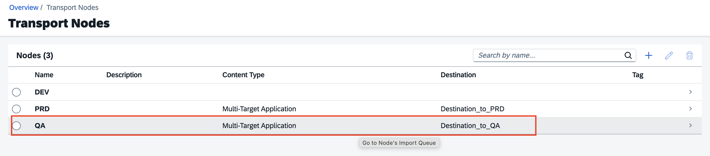
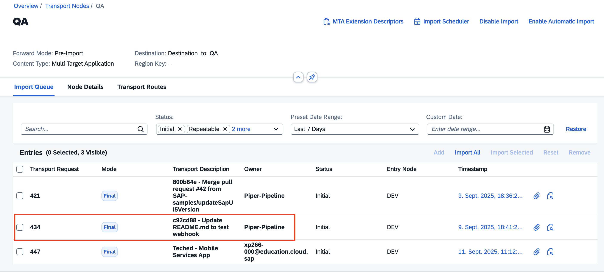

# Verify all Release Steps

In this exercise, we will verify the pipeline job status covering the different stages. Especially the release stage for the SAP Cloud Transport Management transport and the result are of interest.

## Exercise 5.0 - Check the Pipeline Job Status

1. Go to [Continuous Integration & Delivery service](https://xp266-central000-aoh299xc.eu10.cicd.cloud.sap/ui/index.html).

      
2. In the Jobs area click on your pipeline job.

      
3. Check whether the pipeline job finished successfully and click on the finished result to check the execution log.

     
4. Browse through the different stages and click on the Release stage.

     
5. In the log file search for "createdTransportRequestId".

     
6. This transport should be available in your CTMS tenant.

## Exercise 5.1 - Verify Transports created in SAP Cloud Transport Management

1. Open [Cloud Transport Management service](https://xp266-central000-aoh299xc.ts.cfapps.eu10.hana.ondemand.com/main/webapp/index.html).
2. Go to Transport Nodes.

     
3. Select the node QA and navigate to the import queue by clicking on the line item.

     
4. Look for your transport ID. The transport will appear in status "Initial".

     

## Summary

You've now verified the pipeline and release steps. Furthermore, you know the transport is available in Cloud Transport Management for your delivery to QA and Production.

Continue with [Manage your Feature in Cloud ALM & Deployment](../ex6/README.md)
