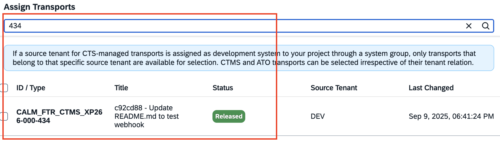
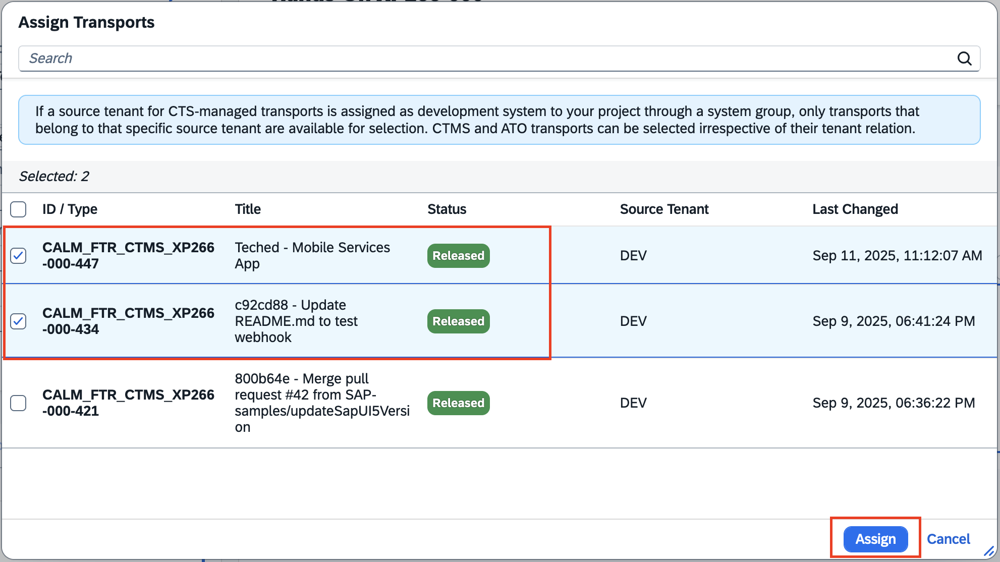
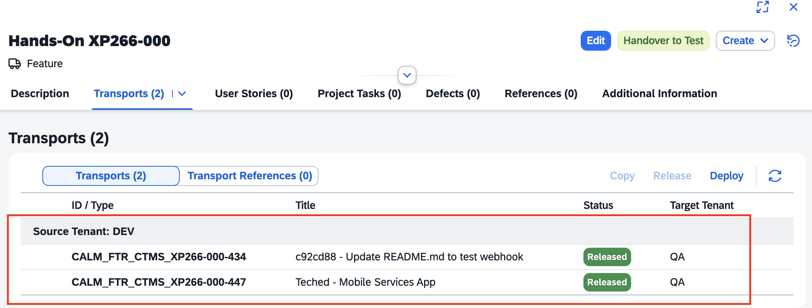
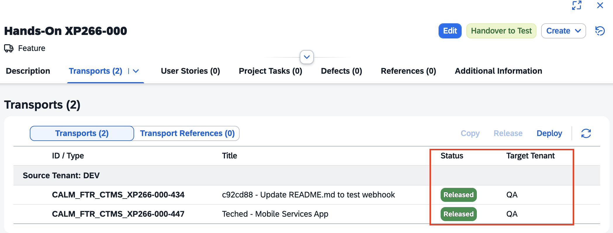
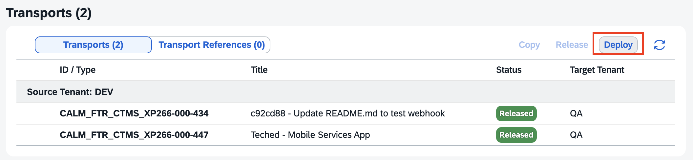
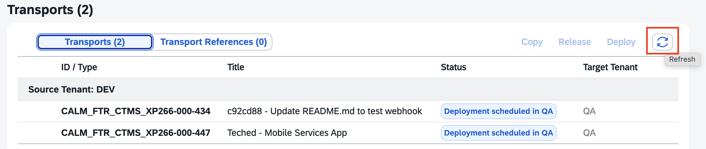

# Exercise 6 - Manage your Feature in Cloud ALM & Deployment

In this exercise, we will manage the assignment and deployment of Cloud Transport Management service transport requests in SAP Cloud ALM. By managing the lifecycle of your Feature you can keep track of your changes with a governed process. This includes confirmation of successful test in Quality Assurance and the approval for the deployment to the Production environment. Eventually you can validate the deployed application in the Production environment.

## Exercise 6.0 - Manage the lifecycle of your feature

1. Go to the **Features** application in [SAP Cloud ALM](https://xp266-calm-lf1zy9xc.eu10-004.alm.cloud.sap/launchpad#Shell-home).
2. Go to **your Feature** created in Exercise 2.

     
3. Switch to **Edit** mode.

     
4. Go to the **Transports** section and click **"Assign"**.

     
5. In the selection dialog search for **your transport IDs** (prefix is the destination name of the connection between SAP Cloud ALM and SAP Cloud Transport Management).

     
6. **Select the transport for your Fiori app** and click "Assign". Additionally, select the transport for your Mobile Services app if you've performed the optional exercise.

     
7. **Save and Close** the Feature.

8. The **transports are assigned** to your Feature.

     

**Congratulations!** You have successfully documented your changes in the Feature.

## Exercise 6.1 - Deploy and monitor changes in your Quality Assurance and Production environment

1. The **transports in the Transports** section are **released** and show the **CTMS target node** as target.

     
2. Click **"Deploy"** and confirm the deployment to the target node in the dialog.

     
3. The Status of the transports is changed to "Deployment Scheduled in QA".

      
4. Use the **Refresh button** on the Transports Section **to retrieve the import results**.

     
4. As soon as the imports have been succesful the **status changes to "Deployed in QA"**.

      
5. Now you can **change the Feature status to "In Testing"** by clicking **"Handover to Test"**.

     
6. Let's assume the test has been successful - click on action button **"Confirm Successful Test"**.

7. Click on **"Analytics"** in the top right corner of the Features Overview list to **access the Feature Traceability**.

     
8. There you can check whether your Feature is in **status "Successfully Tested"**.

     
9. Navigate back to the Feature and **approve the Feature for Production** by clicking "Approve for Production".

     
10. In status "Ready for Production" you can **trigger the deployment to production by clicking "Deploy"** in the Transports section. Confirm the dialog for the deployment to target PRD.

     
11. Refresh the section to retrieve the import results.

     

This concludes your deployment to production. **Awesome!**

## Exercise 6.2 - Find and access the deployed applications

1. Before confirming the Feature deployment to production you can check your deployed applications in the production environment. In your BTP subaccount named with XP266_PROD0XX in the SAP BTP cockpit, **go to Cloud Foundry Environment and select the dev space**.

     
2. In the application list click on **bookshop-srv**.

     
3. Go to **Application Routes** and click the link below.

    br>
4. Click on **/admin-books/webapp/index.html** and verify that the new entries appear.

    br>
5. Now verify the same for your Mobile Services app.

6. After validating the correctness you can **confirm your Feature** in SAP Cloud ALM **by clicking "Confirm Deployment"**.

     
7. The **status "Deployed"** is the **final state of the Feature**. It cannot be changed anymore.

     

## Summary
In this exercise you have learned how to deploy changes via Feature in SAP Cloud ALM through your landscape. In addition, you were able to keep track by using the Feature Traceability and confirm the correct function in Production.

**Congratulations! You have successfully completed the hands-on session!**
